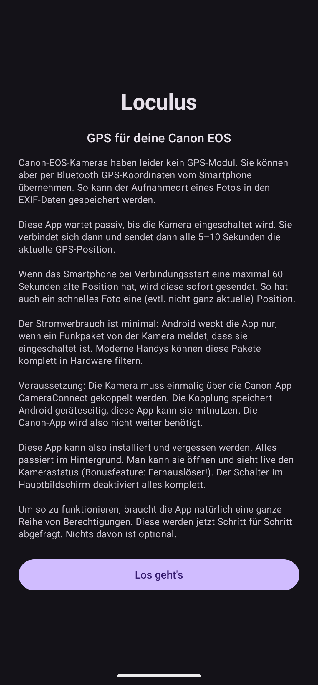
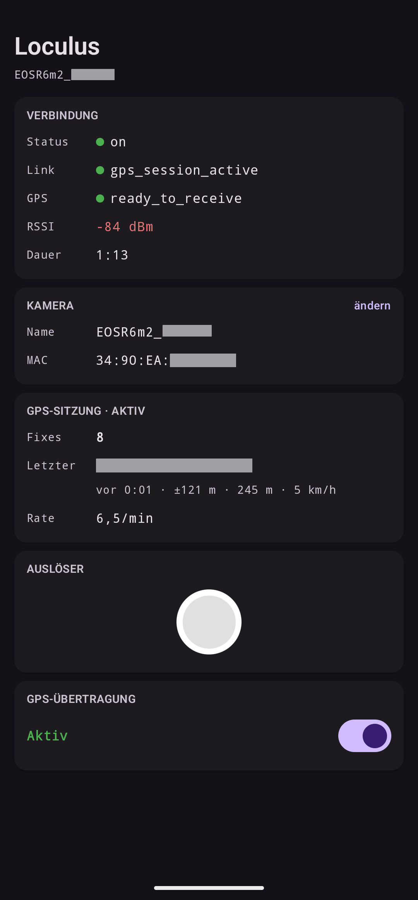
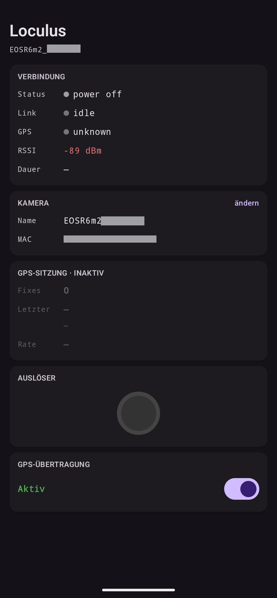

<p align="center">
  
</p>

# Loculus

Android app that streams GPS coordinates to Canon EOS cameras over Bluetooth LE, so your photos get EXIF geotags automatically — without keeping Canon's Camera Connect app running.

Turn your camera on, and Loculus handles the rest: it detects the camera's BLE advertisement, connects, and starts streaming your phone's location. When the camera goes to sleep or out of range, the connection tears down cleanly and Loculus waits for the next wake-up.

<p align="center">
  
  &nbsp;
  
  &nbsp;
  
</p>

## Supported Cameras

Tested and verified on the **Canon EOS R6 Mark II**. Should work with other Canon EOS models that support BLE GPS via Canon Camera Connect — the protocol appears to be shared across the EOS R lineup. If you test it on another model, please open an issue.

## Prerequisites

- Android phone running **Android 14+** (API 34)
- Camera must be paired with the phone via Canon Camera Connect first (Loculus reuses the existing bond)

## Build

```sh
./gradlew assembleRelease
```

APK: `app/build/outputs/apk/release/loculus-0.1.1-release.apk`

Toolchain: AGP 9.2, Kotlin 2.3, Compose, compileSdk 37, minSdk 34, Java 21. Strict compiler and lint settings (`allWarningsAsErrors`, `warningsAsErrors`). R8 strips `Log.v/d/i/w` from release builds via proguard rules.

## Troubleshooting

**Keine Verbindung nach einem Kamera-Firmware-Update:** After a camera firmware update, the Bluetooth connection may fail — this also affects Canon's own Camera Connect app. Fix: reset the camera's communication settings, forget the camera in Android Bluetooth settings, and re-pair.

## How It Works

Loculus uses a scan-first architecture with zero battery waste:

1. **Passive scan** — listens for Canon BLE advertisements and reads the power-state byte to distinguish awake vs. sleeping cameras. No connection attempt, no risk of waking a sleeping camera.
2. **Background detection** — when the app is not visible, an OS-offloaded scan (PendingIntent) wakes the app only on a matching awake advertisement.
3. **GATT session** — connects, performs a minimal handshake (~550 ms), and starts streaming 20-byte binary GPS frames at 10-second intervals.
4. **Graceful teardown** — sends a GPS-stop command and disconnects cleanly when the camera goes to sleep or out of range.

The BLE protocol was reverse-engineered from HCI snoop logs. See [docs/protocol.md](docs/protocol.md) for the full technical reference, and [docs/entwicklungsverlauf.md](docs/entwicklungsverlauf.md) for the story of how we got there.

## Architecture

Single-module Kotlin/Compose app. No DI, no repository pattern.

| Component | Role |
|-----------|------|
| `CanonScanRegistrar` | OS-offloaded BLE scan (PendingIntent), wakes app on camera power-on |
| `FgScanner` | Foreground scan (activity lifecycle), shows live status in UI |
| `GpsTrackingService` | Foreground service, owns the GATT session, streams GPS fixes |
| `CanonGattClient` | GATT state machine with op queue |
| `CanonGpsFrame` | 20-byte binary GPS frame encoder |
| `TrackingState` | Singleton StateFlow bridge between service and UI |

## Acknowledgments

This app was largely developed with [Claude Code](https://claude.ai/code) (Anthropic's AI coding agent). The reverse engineering, protocol analysis, and implementation were done collaboratively — Claude wrote most of the code, with human guidance on architecture decisions, on-device testing, and HCI snoop analysis.

- [gkoh/furble](https://github.com/gkoh/furble) — ESP32 Canon remote with GPS support. [Issue #189](https://github.com/gkoh/furble/issues/189) documents the GPS frame format and kickoff sequence (tested on R6).
- [Ian Douglas Scott](https://iandouglasscott.com/2018/07/04/canon-dslr-bluetooth-remote-protocol/) — first public analysis of the Canon BLE pairing and shutter protocol (2018).

## License

[GPL-3.0-only](LICENSE)
